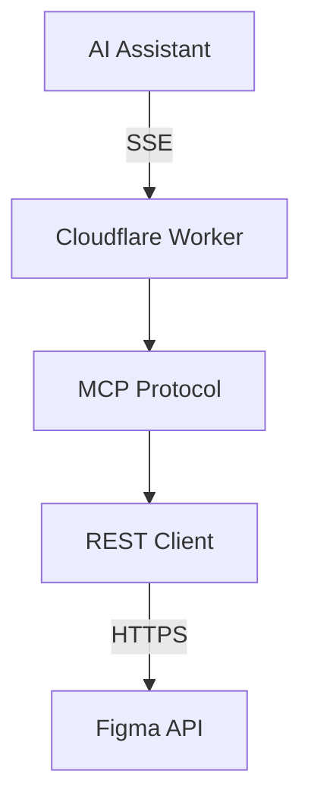
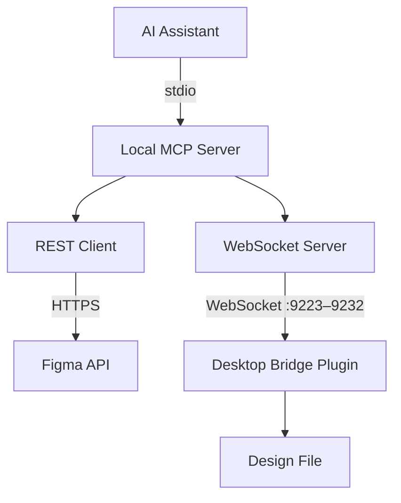
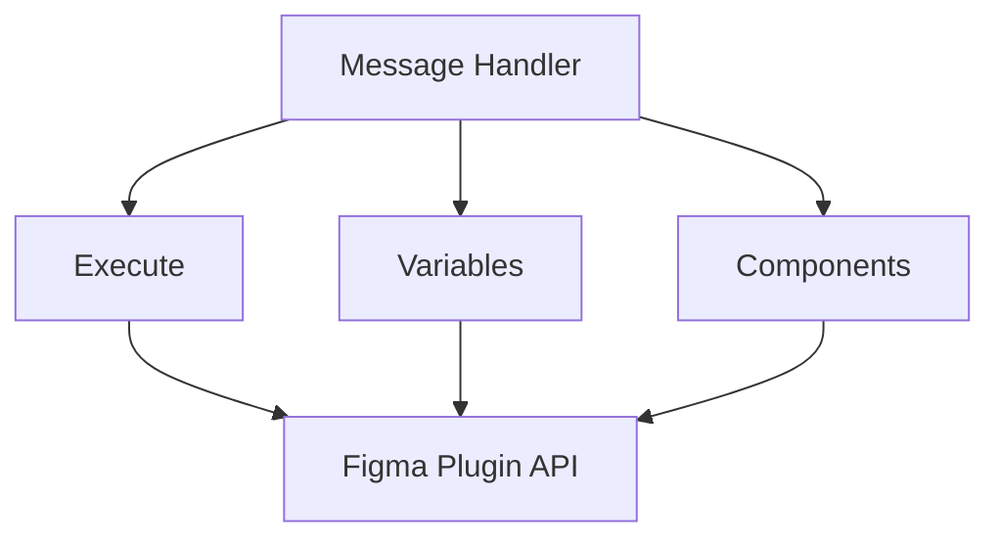
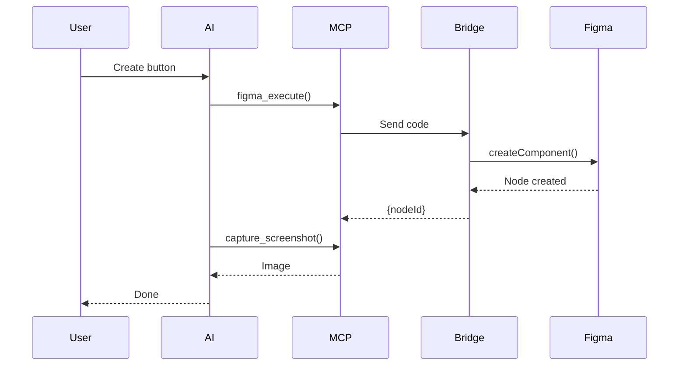
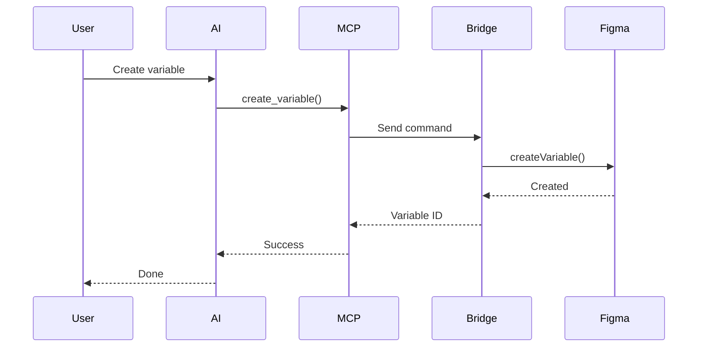
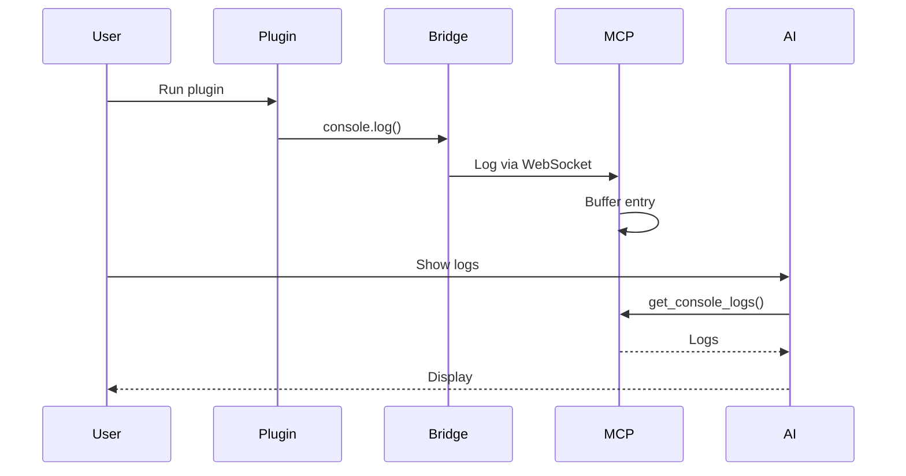

# Figma Console MCP - Technical Architecture

## Overview

Figma Console MCP provides AI assistants with real-time access to Figma for debugging, design system extraction, and design creation. The server supports two deployment modes with different capabilities.

## Deployment Modes

### Remote Mode (SSE/OAuth)

**Best for:** Design system extraction, API-based operations, zero-setup experience



**Capabilities:**
- Design system extraction (variables, styles, components)
- File structure queries
- Component images
- Console log capture (requires local)
- Design creation (requires Desktop Bridge)
- Variable management (requires Desktop Bridge)

---

### Local Mode (Desktop Bridge)

**Best for:** Plugin debugging, design creation, variable management, full capabilities



**Transport:**
- **WebSocket** — via Desktop Bridge Plugin on ports 9223–9232. No debug flags needed. Supports real-time selection tracking, document change monitoring, and console capture.
- The server tries port 9223 first, then automatically falls back through ports 9224–9232 if another instance is already running (multi-instance support since v1.10.0).
- All 57+ tools work through the WebSocket transport.

**Capabilities:**
- Everything in Remote Mode, plus:
- Console log capture (real-time)
- Design creation via Plugin API
- Variable CRUD operations
- Component arrangement and organization
- Real-time selection and document change tracking (WebSocket)
- Zero-latency local execution

---

## Component Details

### MCP Server Core (`src/local.ts`)

The main server implements the Model Context Protocol with stdio transport for local mode.

**Key Responsibilities:**
- Tool registration (57+ tools in Local Mode, 22 in Remote Mode)
- Request routing and validation
- Figma API client management
- Desktop Bridge communication via WebSocket

**Tool Categories:**

| Category | Tools | Transport |
|----------|-------|-----------|
| Navigation | `figma_navigate`, `figma_get_status` | WebSocket |
| Console | `figma_get_console_logs`, `figma_watch_console`, `figma_clear_console` | WebSocket |
| Screenshots | `figma_take_screenshot`, `figma_capture_screenshot` | WebSocket |
| Design System | `figma_get_variables`, `figma_get_styles`, `figma_get_component` | REST API |
| Design Creation | `figma_execute`, `figma_arrange_component_set` | WebSocket (Plugin) |
| Variables | `figma_create_variable`, `figma_update_variable`, etc. | WebSocket (Plugin) |
| Real-Time | `figma_get_selection`, `figma_get_design_changes` | WebSocket |

---

### Desktop Bridge Plugin

The Desktop Bridge is a Figma plugin that runs inside Figma Desktop and provides access to the full Figma Plugin API.

**Architecture:**



**Communication Protocol:**

The MCP server communicates with the Desktop Bridge via WebSocket:

1. **MCP Server** sends JSON command via WebSocket (ports 9223–9232)
2. **Plugin UI** receives and forwards via `postMessage` to plugin code
3. **Plugin Code** executes Figma Plugin API calls
4. **Plugin Code** returns result via `figma.ui.postMessage`
5. **Plugin UI** sends response back via WebSocket
6. **MCP Server** receives correlated response

---

### Transport Layer

The MCP server uses a transport abstraction (`IFigmaConnector` interface) backed by WebSocket:

#### WebSocket Transport

The Desktop Bridge Plugin connects via WebSocket on ports 9223–9232. No special Figma launch flags needed.

**Features:**
- Real-time selection tracking (`figma_get_selection`)
- Document change monitoring (`figma_get_design_changes`)
- File identity tracking (file key, name, current page)
- Plugin-context console capture
- Instant availability check (no network timeout)

**Communication flow:**
```
MCP Server ←WebSocket (ports 9223–9232)→ Plugin UI (ui.html) ←postMessage→ Plugin Code (code.js) ←figma.*→ Figma
```

#### Multi-Instance Support (v1.10.0+)

Multiple MCP server processes can run simultaneously (e.g., Claude Desktop Chat tab, Code tab, Cursor, etc.). Each server binds to the first available port in the range 9223–9232. The Desktop Bridge Plugin scans all ports in the range and connects to every active server.

#### Transport Detection

The MCP server checks if a WebSocket client is connected (instant, under 1ms). If connected, commands route through WebSocket. If no client is connected, setup instructions are returned.

All 57+ tools work through the WebSocket transport.

---

### Figma REST API Client

Used for design system extraction and file queries.

**Endpoints Used:**

| Endpoint | Purpose |
|----------|---------|
| `GET /v1/files/:key` | File structure and metadata |
| `GET /v1/files/:key/nodes` | Specific node data |
| `GET /v1/files/:key/styles` | Style definitions |
| `GET /v1/files/:key/variables/local` | Variable collections (Enterprise) |
| `GET /v1/images/:key` | Rendered images |

**Authentication:**
- **Remote Mode:** OAuth 2.0 with automatic token refresh
- **Local Mode:** Personal Access Token via environment variable

---

## Data Flow Examples

### Design Creation Flow



### Variable Management Flow



### Console Debugging Flow



---

## Security Considerations

### Authentication

- **Personal Access Tokens:** Stored in environment variables, never logged
- **OAuth Tokens:** Encrypted at rest, automatic refresh
- **No credential storage:** Tokens passed per-request

### Sandboxing

- **Plugin Execution:** Runs in Figma's sandboxed plugin environment
- **Code Validation:** Basic validation before execution
- **No filesystem access:** Plugin code cannot access local files

### Data Privacy

- **Console Logs:** Stored in memory only, cleared on restart
- **Screenshots:** Temporary files with automatic cleanup
- **No telemetry:** No data sent to external services

---

## Performance Considerations

### Latency Targets

| Operation | Target | Actual |
|-----------|--------|--------|
| Console log retrieval | under 100ms | ~50ms |
| Screenshot capture | under 2s | ~1s |
| Design creation | under 5s | 1-3s |
| Variable operations | under 500ms | ~200ms |

### Memory Management

- **Log Buffer:** Circular buffer, configurable size (default: 1000 entries)
- **Screenshots:** Disk-based with 1-hour TTL cleanup
- **Connection Pooling:** WebSocket connections reused

### Optimization Strategies

- Batch operations where possible
- Lazy loading of component data
- Efficient JSON serialization
- Connection keepalive for WebSocket

---

## Development

### Local Development

```bash
# Install dependencies
npm install

# Run in development mode
npm run dev:local

# Build for production
npm run build:local
```

### Testing

```bash
# Run all tests
npm test

# Run with coverage
npm run test:coverage
```

### Project Structure

```
figma-console-mcp/
├── src/
│   ├── local.ts          # Main MCP server (local mode)
│   ├── index.ts          # Cloudflare Workers entry (remote mode)
│   └── types/            # TypeScript definitions
├── figma-desktop-bridge/
│   ├── code.ts           # Plugin main code
│   ├── ui.html           # Plugin UI
│   └── manifest.json     # Plugin manifest
├── docs/                 # Documentation
└── tests/                # Test suites
```
